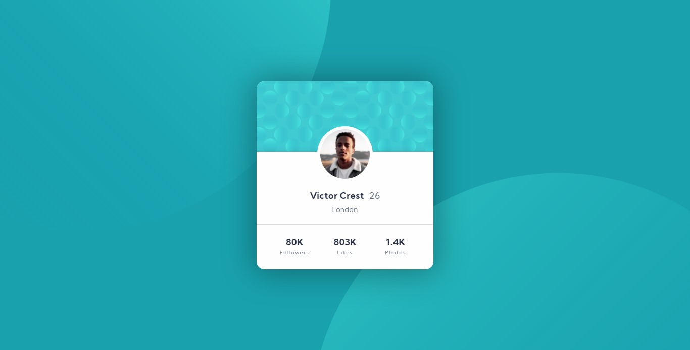

# Profile card component solution

This is a solution to the [Profile card component challenge on Frontend Mentor](https://www.frontendmentor.io/challenges/profile-card-component-cfArpWshJ).

## Table of contents

- [Overview](#overview)
  - [The challenge](#the-challenge)
  - [Screenshot](#screenshot)
  - [Links](#links)
- [My process](#my-process)
  - [Built with](#built-with)
  - [What I learned](#what-i-learned)
  - [Continued development](#continued-development)
  - [Useful resources](#useful-resources)
- [Author](#author)
- [Acknowledgments](#acknowledgments)

## Overview

### The challenge

- Build out the project to the designs provided

### Screenshot

### Links

- Solution URL: [Solution URL here](https://www.frontendmentor.io/solutions/my-first-solution-AKzSHe3xT)
- Live Site URL: [Profile card component](https://lucasdemouramacedo.github.io/profile-card-component-main/)

## My process

### Built with

- Semantic HTML5 markup
- CSS custom properties
- Mobile-first workflow
- Sass

### What I learned

- Positioning
- Animations
- Sass components

### Continued development

In future projects I will continue with a focus on improving performance in interface design.

### Useful resources

- [dpw channel](https://www.youtube.com/channel/UCdHcHgSrWidiOg-mNFNB1Nw) - This channel helped me with CSS and introduce me to Sass.

## Author

- Github - [lucasdemouramacedo](https://github.com/lucasdemouramacedo)
- Frontend Mentor - [@lucasdemouramacedo](https://www.frontendmentor.io/profile/lucasdemouramacedo)
- LinkedIn - [@lucasdemouramacedo](https://www.linkedin.com/in/lucasdemouramacedo/)
- Instagram - [@lucasmouramacedo](https://www.instagram.com/lucasmouramacedo/)
